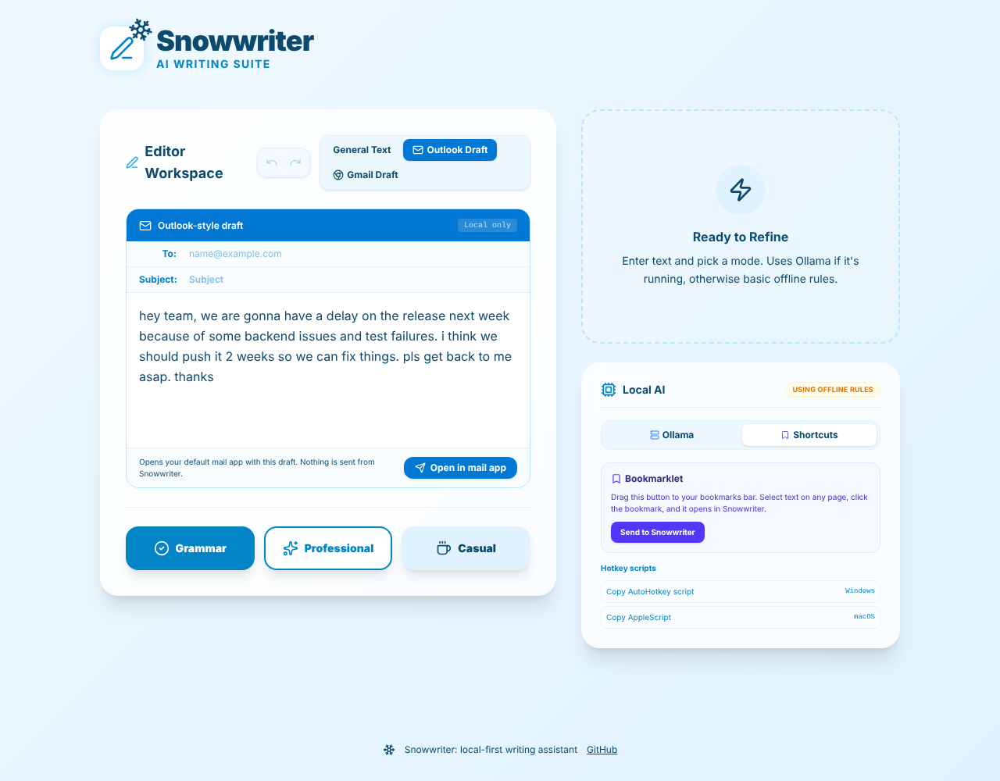

# Snowwriter

[](https://github.com/Davidrbenner/Snowwriter/actions/workflows/ci.yml)

A local-first writing assistant. Paste text, pick a mode (fix grammar, rewrite professionally, or rewrite casually), and Snowwriter runs it through a language model on your own machine with [Ollama](https://ollama.com/). No cloud APIs, no API keys, and your text never leaves your computer.



## Features

- **Three rewrite modes:** grammar fix, professional tone, casual tone.
- **Local LLM via Ollama:** works with any model you've pulled (`gemma2:2b`, `llama3.2`, `mistral`, and so on). A "Test connection" button checks the server and tells you if the model isn't installed.
- **Offline fallback:** if Ollama isn't running, a small rule-based engine still fixes common shorthand ("u r" to "you are", "dont" to "don't"), capitalization, and spacing. The result shows which engine produced it.
- **Email drafts:** Outlook-style and Gmail-style compose views. "Open in mail app" hands the draft to your default mail client through `mailto:`.
- **Undo and redo** with Ctrl/Cmd+Z and Ctrl/Cmd+Y (or Shift+Z).
- **Send text from anywhere:** a bookmarklet plus AutoHotkey (Windows) and AppleScript (macOS) snippets open your selected text in Snowwriter.

## How it works

```
Editor ──> processText(mode)
             │
             ├─> lib/ollama.ts   POST /api/generate  (local Ollama server)
             │        │ fails or times out
             │        v
             └─> lib/rewriter.ts  rule-based fallback
```

| File | What it does |
| --- | --- |
| `src/lib/ollama.ts` | Ollama client: prompt building, `/api/tags` health check, `/api/generate` with timeouts |
| `src/lib/rewriter.ts` | Offline rules compiled into a single regex per mode, longest phrase first, word-boundary safe |
| `src/lib/history.ts` | Pure undo/redo state with a capped history |
| `src/App.tsx` | UI (React 19, Tailwind CSS 4, Motion) |

The logic lives in small, pure modules so it can be unit tested without a browser.

## Getting started

Requires Node.js 20 or newer.

```bash
git clone https://github.com/Davidrbenner/Snowwriter.git
cd Snowwriter
npm install
npm run dev        # http://localhost:3000
```

For real AI rewriting, install Ollama and pull a small model:

```bash
ollama pull gemma2:2b
```

Without Ollama the app still works, using the offline rules.

## Scripts

| Command | Purpose |
| --- | --- |
| `npm run dev` | Start the dev server |
| `npm test` | Run unit tests (Vitest) |
| `npm run typecheck` | TypeScript strict mode check |
| `npm run build` | Production build to `dist/` |
| `npm run check` | Typecheck, test, and build (same as CI) |

GitHub Actions runs `typecheck`, `test`, and `build` on every push and pull request.

## A note on hosting

Snowwriter builds to static files, so it can be hosted anywhere. Browsers block an HTTPS page from calling `http://localhost`, so a hosted copy usually can't reach your local Ollama and will use the offline rules. For full AI rewriting, run it locally.

## Roadmap

- In-browser inference with WebGPU (WebLLM or Transformers.js), so no Ollama install is needed
- Streaming output from Ollama
- Inline diff view showing what changed
- Browser extension for rewriting text directly in Gmail and other sites

## License

Apache-2.0. See [LICENSE](LICENSE).
